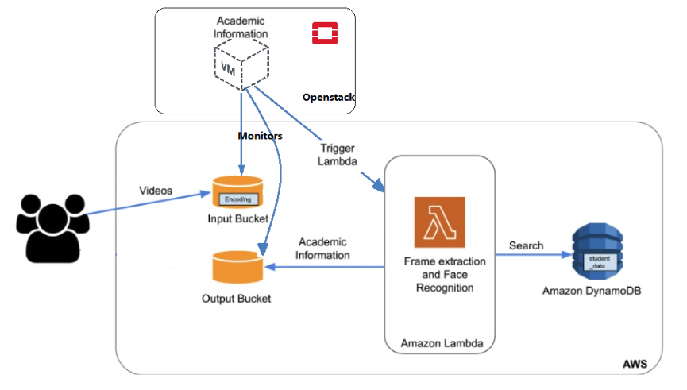

# HybridSphere : The Hybrid Cloud Environment on AWS and OpenStack

For this project, we aim to transfer the elastic application created in the second project,
which can automatically scale up and down on-demand and in a cost-effective manner, to a
hybrid cloud environment. This will be achieved by utilizing resources from both Amazon Web
Services (AWS) and OpenStack (as a private cloud). AWS is a widely used cloud provider that
offers a range of compute, storage, and messaging services. On the other hand, OpenStack is a
free and open-source cloud computing platform that is typically used for Infrastructure as a
Service (IaaS) in both public and private clouds, where users can access virtual servers and
other resources. The application we develop will provide a valuable cloud service to users, and
the techniques and technologies we learn will be useful for creating many other services in the
future. OpenStack has an intuitive dashboard that enables system administrators to manage
cloud resources such as compute, storage, and networking.

Architecture:

1. S3: Two S3 buckets are used, one for input and one for output. The input bucket has a
trigger that activates the lambda function whenever a ‘put’ object configuration is run.
2. ECR: The lambda function is deployed using ECR. Whenever there is a code update,
the new docker image should be uploaded to the Elastic Container Registry, so the
Lambda function can pull the latest image.
3. Lambda Function: The function receives the S3 notification event object, reads the
video file, splits it into frames, and identifies faces in them. It then connects to
DynamoDB, which stores additional information, processes the output, and uploads it to
the S3 output bucket in CSV format.
4. DynamoDB: It stores additional information that is queried and searched through the
lambda function.
5. OpenStack: OpenStack is a platform that offers Infrastructure as a Service (IaaS),
managing cloud resources like compute, storage, and networking. For this project, we
will be using OpenStack Nova to handle our computing needs. The next step involves
setting up a virtual machine (VM) in OpenStack and running our code within it. This will
allow us to monitor an S3 bucket and trigger lambda functions as needed.

Autoscaling:

The autoscaling feature of AWS Lambda allows for the automatic adjustment of the number of
function instances based on the incoming event rate. When traffic increases, it scales out by
adding more instances to handle the workload, and when traffic decreases, it scales in by
removing idle instances to save resources. This feature enables Lambda to efficiently handle
fluctuating levels of traffic and ensures that functions remain available to process events without
any manual intervention required from the user. Being fully managed by AWS, the autoscaling
feature does not require any upfront provisioning or configuration, freeing up the user to focus
on their core application logic.

Code:

1. Dockerfile: This file serves a critical function in producing the container image,
encompassing essential files and volumes. Its precision is of paramount importance
since it assures the successful creation of the image, which is pivotal for uploading to the
Elastic Container Registry (ECR).
2. handler.py: This file works in the following manner:
a. The function starts by reading the event that caused it to trigger.
b. It then proceeds to download the video file from the S3 bucket that caused the
trigger (input bucket), saving it in the tmp folder provided by Lambda.
c. Using the face_recognition library, the function splits the video into frames and
checks for the presence of any faces in each frame.
d. The faces found in the video are compared to the known faces provided in the
encoding file, which is read using the get_encoding() function.
e. The name of the matched face is used to search for more information in
DynamoDB, and a CSV file is generated and pushed to the S3 output bucket.
3. workload.py: This file involves subjecting our lambda function's code to various test
cases in order to thoroughly test it using OpenStack
4. OpenStack
a. To set up OpenStack, the first step is to install an Ubuntu virtual machine. This can be
achieved by installing Virtual Box on the host operating system.
b. Using the ISO file, we can install an Ubuntu virtual machine in Virtual Box.
c. The first step is to download the Devstack folder using the git cli command after installing
the Ubuntu OS in Virtual Box.
d. Next, we run the stack.sh file inside the Devstack folder which installs all the required
files and utilities. Once the installation is complete, we can access the Horizon UI using
the provided credentials.
e. In the Horizon UI, we create a private network and assign a private router, add a security
group, and create a floating IP.
f. We then create our image from the image tab using the Ubuntu image.
g. After creating the image, we create an instance using this image and the private network
we set up earlier.
h. Once the instance is created, we SSH into it and install all the necessary modules and
files for the web-tier code.
i. Finally, we run the web-tier code from our OpenStack instance.
To install and execute our program, we recommend using a Dockerized environment due to
potential variations in machine setups. The following steps can be followed:
1. Install Docker.
2. Build the Docker image using the provided Dockerfile.
3. Run the Docker image.
4. Execute the handler.py handler function by accessing the container.
Here are the steps to run the program using the Lambda function:
1. Build the Docker image.
2. Push the Docker image to the ECR.
3. Create the Lambda function using the ECR image URI.
4. Set the input S3 bucket as the trigger for this Lambda function.
5. Upload video files to the input bucket. The processed results in CSV format will be
available in the output bucket.
